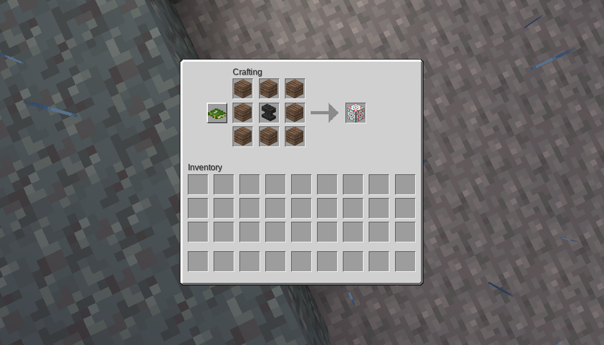
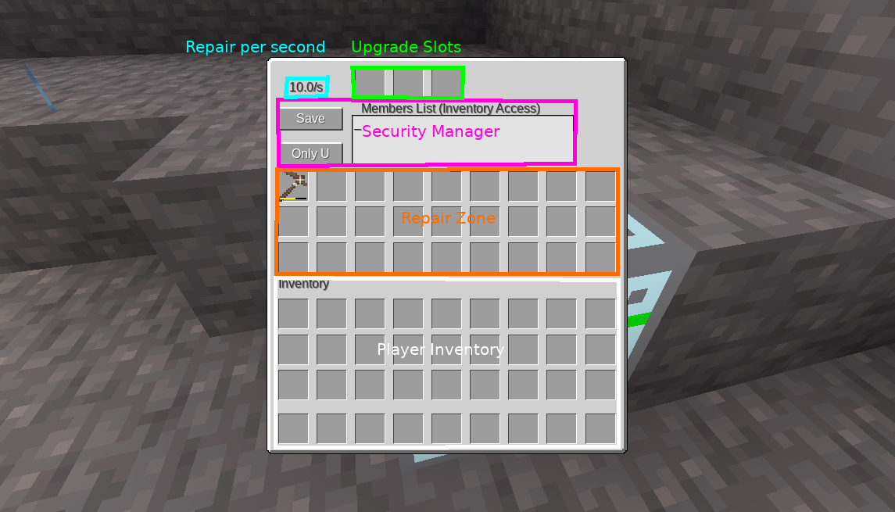
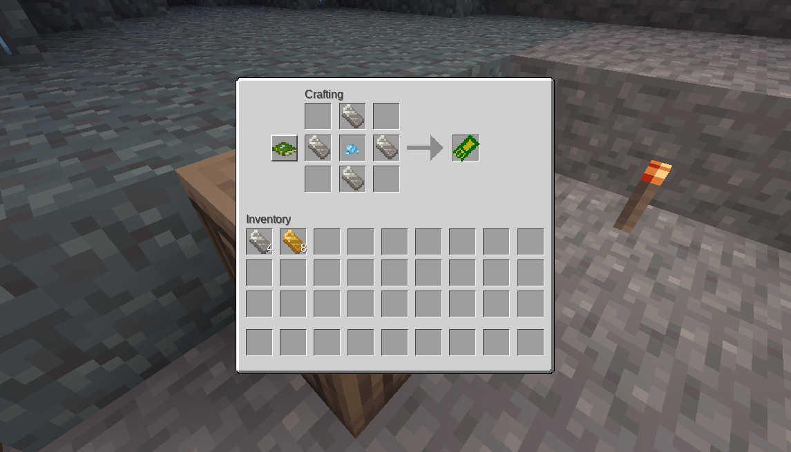
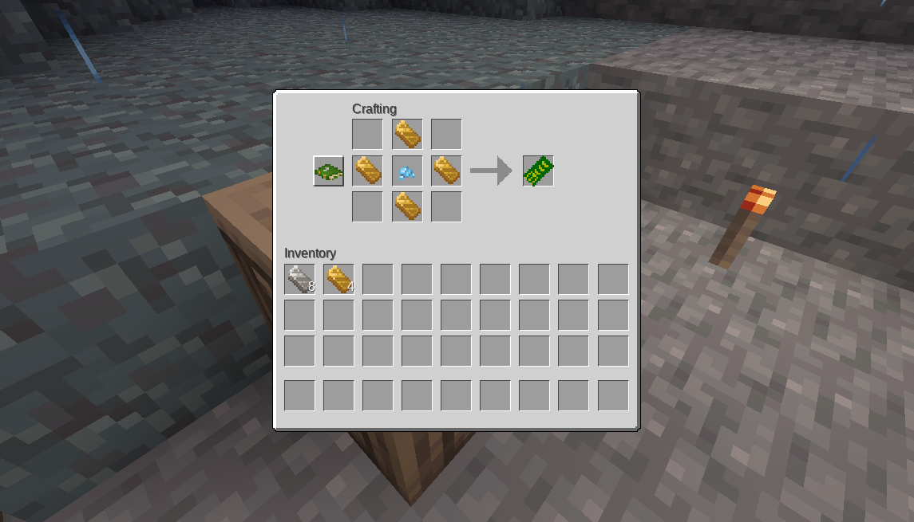
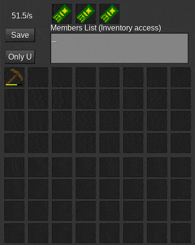

# Item Repair > Help > MCL

## Main machine:

## Upgrades: (Mix and Match)

Repair Upgrade Capacitor

> Increases amount repaired per repair rate.

Repair Upgrade Processor

> Increases rate at which repairing will occur.

Repair Upgrade Complex

> Increases both amount repaired and increases rate at which repairing will occur.

## Preview

> For brevity I didn't make a MCL version of the gif. (This is the MTG version, but the same thing will occur in the MCL version too, just looks are different)

